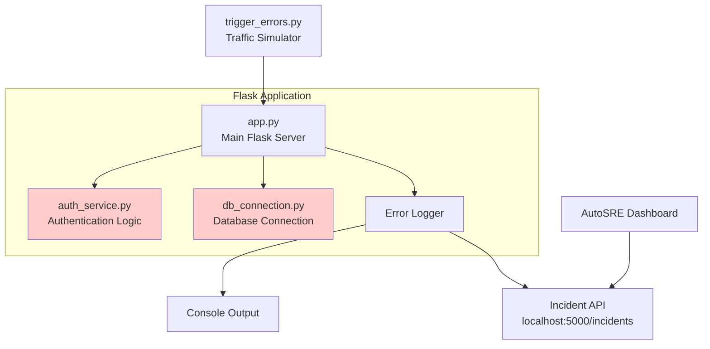

# Design Document: Dummy Error App

## Overview

The dummy-error-app is a Flask-based web application intentionally designed with specific bugs to demonstrate AutoSRE system capabilities. The application serves as a controlled testing environment where errors can be reliably triggered, logged, and analyzed.

The system consists of three main components:
1. A Flask web server with multiple endpoints (health check, authentication, data retrieval)
2. Intentionally buggy service modules (authentication and database connection)
3. An error triggering script that simulates production traffic patterns

The application integrates with an external incident API to report errors in real-time, enabling the AutoSRE dashboard to monitor and analyze error patterns. This design ensures reproducible error scenarios while maintaining a realistic application structure.

## Architecture

The application follows a modular architecture with clear separation between the web layer, service layer, and error handling infrastructure.



The red-highlighted components (auth_service and db_connection) contain intentional bugs. The error logger captures exceptions from these components and forwards them to the incident API for analysis.

### Component Interaction Flow

1. **Normal Request Flow**: trigger_errors.py → Flask endpoints → Service modules → Response
2. **Error Flow**: Service module exception → Error Logger → Console + Incident API → AutoSRE Dashboard

## Components and Interfaces

### Flask Application (app.py)

The main application server that orchestrates all endpoints and error handling.

**Responsibilities:**
- Initialize Flask application on port 8080
- Define and route HTTP endpoints
- Integrate error logging middleware
- Maintain application lifecycle

**Endpoints:**
- `GET /health`: Health check endpoint returning 200 OK
- `POST /auth/login`: Authentication endpoint that triggers auth bug
- `GET /api/data`: Data retrieval endpoint that triggers database bug

**Interface:**
```python
def create_app() -> Flask:
    """Initialize and configure Flask application"""
    
def health() -> tuple[dict, int]:
    """Health check endpoint"""
    
def login() -> tuple[dict, int]:
    """Authentication endpoint"""
    
def get_data() -> tuple[dict, int]:
    """Data retrieval endpoint"""
```

### Authentication Service (auth_service.py)

Handles authentication logic with an intentional null pointer bug.

**Responsibilities:**
- Validate authorization headers
- Contain intentional TypeError bug (missing null check)
- Demonstrate typical authentication failure patterns

**Bug Location:** Lines 15-20 of auth_service.py

**Bug Mechanism:** Attempts to access Authorization header without checking if it exists, causing TypeError when header is None.

**Interface:**
```python
def validate_auth(request) -> bool:
    """
    Validates authorization header from request.
    BUG: Missing null check on authorization header
    """
```

### Database Connection Module (db_connection.py)

Manages database connections with an intentional resource leak bug.

**Responsibilities:**
- Provide database connection pooling
- Contain intentional connection leak (missing finally block)
- Demonstrate resource exhaustion patterns

**Bug Mechanism:** Opens database connections without proper cleanup in finally block, causing pool exhaustion after 5-10 requests.

**Interface:**
```python
def get_connection():
    """
    Retrieves database connection from pool.
    BUG: Missing finally block to close connections
    """
    
def query_data() -> list:
    """Executes database query using connection"""
```

### Error Logger

Captures and reports all application errors to multiple destinations.

**Responsibilities:**
- Intercept all unhandled exceptions
- Log errors to console with timestamps
- Forward error details to incident API
- Extract stack traces and error metadata

**Interface:**
```python
def log_error(error: Exception, context: dict) -> None:
    """
    Logs error to console and sends to incident API
    
    Args:
        error: The exception that occurred
        context: Additional context (file, line, endpoint)
    """
    
def send_to_incident_api(incident_data: dict) -> None:
    """Sends incident report to localhost:5000/incidents"""
```

**Incident Data Format:**
```python
{
    "error_type": str,      # Exception class name
    "message": str,         # Error message
    "file": str,           # Source file where error occurred
    "line": int,           # Line number
    "stack_trace": str,    # Full stack trace
    "timestamp": str,      # ISO 8601 timestamp
    "endpoint": str        # API endpoint that triggered error
}
```

### Trigger Script (trigger_errors.py)

Automated script to simulate production traffic and trigger intentional bugs.

**Responsibilities:**
- Send requests to Flask endpoints
- Trigger authentication bug (missing auth header)
- Trigger database bug (multiple rapid requests)
- Run continuously to simulate real traffic

**Interface:**
```python
def trigger_auth_bug() -> None:
    """Sends POST to /auth/login without Authorization header"""
    
def trigger_db_bug() -> None:
    """Sends multiple GET requests to /api/data to exhaust pool"""
    
def run_traffic_simulation() -> None:
    """Main loop that continuously triggers errors"""
```

## Data Models

### Error Incident Model

Represents an error incident sent to the AutoSRE incident API.

```python
class ErrorIncident:
    error_type: str          # e.g., "TypeError", "ConnectionPoolExhausted"
    message: str             # Human-readable error message
    file: str                # Source file path (e.g., "auth_service.py")
    line: int                # Line number where error occurred
    stack_trace: str         # Full Python stack trace
    timestamp: str           # ISO 8601 format (e.g., "2024-01-15T10:30:00Z")
    endpoint: str            # API endpoint (e.g., "/auth/login")
```

### HTTP Request/Response Models

**Health Check Response:**
```python
{
    "status": "healthy"
}
```

**Login Request:**
```python
# Headers
{
    "Authorization": "Bearer <token>"  # Optional - missing triggers bug
}

# Body
{
    "username": str,
    "password": str
}
```

**Login Response (Success):**
```python
{
    "success": True,
    "token": str
}
```

**Data Response:**
```python
{
    "data": [
        {"id": int, "value": str}
    ]
}
```

**Error Response:**
```python
{
    "error": str,
    "details": str
}
```

### Connection Pool State

```python
class ConnectionPool:
    max_connections: int = 5     # Maximum pool size
    active_connections: int      # Currently open connections
    available_connections: int   # Connections available for use
```

